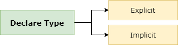
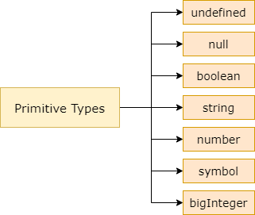
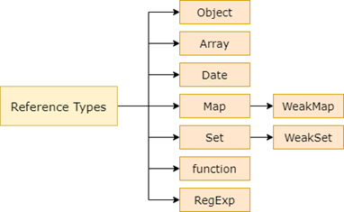

# Mastering Typescript


# Table of Contents

- [ ] Typescript
  - [x] Why Typescript?
    - [x] Static Typing
    - [x] Type Annotation
  - [ ] New Features?
  - [x] Variable Declaration
    - [x] Type Annotations
      - [x] Declare Explicit
      - [x] Declare Implicit
  - [ ] Data Types
    - [ ] Custom Type


----


# Typescript

Last Touched 18-07-2022.

| Parameter                              | Value                                                        | Note |
| -------------------------------------- | ------------------------------------------------------------ | ---- |
| Official Website                       | [Click Here](https://www.typescriptlang.org/)                |      |
| Announcing Typescript 4.8 Beta Version | [Click Here](https://devblogs.microsoft.com/typescript/announcing-typescript-4-8-beta/) |      |
| Release Note Typescript 4.7            | [Click Here](https://www.typescriptlang.org/docs/handbook/release-notes/typescript-4-7.html) |      |
| Typescript Blog                        | [Click Here](https://devblogs.microsoft.com/typescript/)     |      |
| Typescript Compiler Options            | [Click Here](https://www.typescriptlang.org/docs/handbook/compiler-options.html) |      |

Typescript is a javascript superset developed by Microsoft. Typescript is also used in an Open Source Project that inspired Ryan Dahl called Deno, a Runtime Engine that can be used to execute Typescript.


If you look at the picture above, you will understand, every Javascript Code is a typescript and typescript provides new advantages for javascript so it is often called Extended Javascript.

*What if we could strengthen JavaScript with the things that are missing for large scale application development, like static typing, classes [and] modules... that’s what TypeScript is about.*

*—Anders Hejlsberg*

Typescript does not provide new functionality in the runtime, it offers a number of features that help developers to write more maintainable code than using Javascript. One of the features is implementing modern programming language paradigm like object oriented language.

A program written using typescript must first be compiled (technically it should be transpiller) into javascript so that it can be executed by a browser or javascript engine.


As a javascript superset we can convert any javascript file into a typescript file by changing its extension:


Typescript is also a superset of EcmaScript which determines the standard specification for writing javascript. ES Next represents future and final versions of EcmaScript.


As a javascript superset what advantages can typescript provide?


## Why Typescript?


### Static Typing

Javascript is a language that has dynamic typing characteristics, to see how the dynamic typing program is working we need to run it. With dynamic typing we cant make a prediction how the code is expected, so here is the typescript came up as an alternative programming paradigm. With Static Type System on typescript we can make a prediction how the code is expected before it runs.

Static Type System help us to understand the shape and behaviors on our code.

As a superset, typescript provides the new advantage of supporting static typing characteristics. So, what are the advantages of static typing?


Every time we create a new variable we must first define the data type. Once this type has been specified, we cannot change it. This protects developers from a bunch of common bugs and security flaws in the code we write. Software development becomes more secure.

Below we create a variable name with data type number. However we pass a string literal so that the typescript code will fail when it compiles into javascript :

```typescript
let fullname: number;
fullname = "Gun Gun Febrianza"; // compile-time error
```


### Type Annotation

Typescript provide type annotation so any code editor can perform static code analysis, like autocompletion and better refactoring system to improve developer productivity. Type Annotation helping the development of static type checker tools.


---


## New Features?


---


# Variable Declaration


## Type Annotations

Typescript uses Type Annotations to explicitly assign data type to an identifier. When an identifier, variable, function, or object has been assigned a type annotation, the identifier can only use the data type that has been given.

Typescript supports Static Typing which prevents us from creating a generic variable. If we are developing an application using the Deno runtime which uses typescript then we can use the type annotation every time we create an identifier.

When we declare a variable in typescript, we must add a colon and type annotation. Below are the type annotations available in typescript:


To declare the data type of a variable we can do it explicitly or implicitly :




---


### Declare Explicit 

Below is an example of using type annotations on primitive data types. The declaration is done explicitly by asserting the given data type :

```typescript
  const username: string = "Maudy Ayunda";
  const height: number = 167.13;
  const isCute: boolean = true;
```


---


### Declare Implicit

Below is an implicit data type declaration, the typescript compiler will auto-type the data based on the given literal :

```typescript
  const username = "Maudy Ayunda";
  const height = 167.13;
  const isCute = true;
```


---


# Data Types


## Primitive Types

As discussed earlier, JavaScript has 8 Data Types and 7 of them are called primitives or primitive values.



The term primitive is used because it only stores a single value, data is not an object and has no methods. Previously in javascript we could create a primitive type without using a type annotation:


---


## Reference Types

In javascript, reference types are represented by an object. An object is different from a primitive, an object can have different forms and values. An object is capable of storing various values (hetererogenously).

Objects can store all values that belong to primitive types. This flexible nature makes objects can be used to build a custom data type.

When we interact with web browsers using JavaScript we will be acquainted with the built-in objects, a set of objects built into the web browser that we can use to make it easier to solve problems in programming languages. Below is an example of a built-in object in javascript:



The built-in object is also available in Node.js/Deno Runtime Engine, below is an example of a simple object that has properties and methods in the javascript :

```javascript
let Gun = {
    name: "GGF",
    ucapSalam: function () {
        alert("Hello World!!");
    }
};
Gun.ucapSalam(); // Hello World!
```

Here an example on typescript :

```typescript
type humanoid = {
  name: string;
  sayHello(): string;
};

let Gun: humanoid = {
  name: "GGF",
  sayHello: function () {
    return "Hello World!!";
  },
};
console.log(Gun.sayHello()); // Hello World!
```


---


## Custom Type

With the type keyword we can create a new type or a type alias. Below we create a type alias:

```typescript
  type Balance = number;
  type Type = string;
```

Next we create a new type:

```typescript
  type Wallet = {
    name: string;
    amount: Balance;
    symbol: Type;
  };
```

In the Type Wallet above we use two type aliases for the amount and symbol properties. Next we can create a variable with the Wallet data type:

```typescript
  let bitcoinWallet: Wallet = {
    name: "Bitcoin",
    amount: 5.88800007,
    symbol: "BTC",
  };
```

Furthermore, every time we create a variable of type Wallet make sure we fill in every available property otherwise the result will be an error. If you don't want an error to occur then we have to use optional properties using a question mark.

Look at the code below:

```typescript
  type CryptoWallet = {
    name: string;
    amount: Balance;
    symbol?: Type;
  };

  let ethereumWallet: CryptoWallet = {
    name: "Ethereum",
    amount: 23.88800007,
  };
```

The symbol property uses a question mark, so if we don't fill in the symbol property when creating a variable the error will not occur.