# Mastering Typescript


# Table of Contents

- [ ] Typescript
  - [x] Why Typescript?
    - [x] Static Typing
    - [x] Type Annotation
  - [ ] New Features?
- [x] Debugging Typescript
  - [x] Add Source Map
  - [x] Config Debugger

- [x] Variable Declaration
  - [x] Type Annotations
    - [x] Declare Explicit
    - [x] Declare Implicit
- [x] Data Types
  - [x] Primitive Types
    - [x] Immutable
  - [ ] Reference Types
  - [ ] Custom Type
  - [ ] Enums
    - [ ] Javascript Way
    - [ ] Typescript Way
      - [ ] Numeric Enums
      - [ ] String Enums
  - [x] Type Widening
    - [x] Undefined
    - [x] Null
- [ ] Object
  - [ ] Fundamental Object
  
  - [ ] Custom Object Types
    - [ ] Type Template
  
    - [ ] Type Alias
  
    - [ ] Interface
  
    - [ ] Mutable Properties
  
    - [ ] Object Destructure
  
    - [ ] Dynamic Properties
      - [ ] Index Type Signature
  
      - [ ] Record Type
  
    - [ ] Optional Properties
  
    - [ ] Read Only Properties
  
    - [ ] Extending Types
  
    - [ ] Generic Object Types
  
    - [ ] Complex Object Types
  
  - [ ] Object Comparison
  
  - [ ] JSON
    - [ ] JSON & Object Literal
    - [ ] Stringify
    - [ ] Parse JSON
    - [ ] Parse Date in JSON
  
- [ ] Interface
  - [ ] Extending Interface
  - [ ] Intersection Types

- [ ] Modules
  - [ ] Import - Single Module
  - [ ] Import - Entire Module
  - [ ] Import - Rename Module
  - [ ] Compiling Modules

- [ ] Collection
  - [ ] What is Collections?
  - [ ] What is Indexed Collections?
    - [ ] Array
    - [ ] Create Array
    - [ ] Iterate Array
    - [ ] Array Property & Methods
      - [ ] Length Property
      - [ ] Push Method
      - [ ] Pop Method
      - [ ] Shift Method
      - [ ] Unshift Method
      - [ ] Find Method
      - [ ] Find Last Method
      - [ ] Find Index Method
      - [ ] Find Last Index Method
      - [ ] Filter Method
      - [ ] For Each Method

    - [ ] Multidimensional Array
    - [ ] Matrix
    - [ ] Array of Interface

- [ ] Data Structure
  - [ ] Stack
    - [ ] Create Stack Class

    - [ ] Create Stack Object

    - [ ] Call Push Method

    - [ ] Call Peek Method

    - [ ] Call Size Method

    - [ ] Call Pop Method

    - [ ] Call is Empty Method

    - [ ] Call Clear Stack Method

  - [ ] Queue
    - [ ] Create Queue Class

    - [ ] Create Queue Object

    - [ ] Call Enqueue Method

    - [ ] Call Peek Method

    - [ ] Call Size Method

    - [ ] Call Dequeue Method

    - [ ] Call is Empty Method

    - [ ] Call Clear Queue Method

  - [ ] Linked List

  - [ ] Tree

- [ ] Time Programming
  - [ ] ISO 8601
  - [ ] Browser Inconsistent
  - [ ] Timestamp


----


# Typescript

Last Touched 04-09-2022.

| Parameter                              | Value                                                        | Note |
| -------------------------------------- | ------------------------------------------------------------ | ---- |
| Official Website                       | [Click Here](https://www.typescriptlang.org/)                |      |
| Announcing Typescript 4.8 Beta Version | [Click Here](https://devblogs.microsoft.com/typescript/announcing-typescript-4-8-beta/) |      |
| Release Note Typescript 4.7            | [Click Here](https://www.typescriptlang.org/docs/handbook/release-notes/typescript-4-7.html) |      |
| Typescript Blog                        | [Click Here](https://devblogs.microsoft.com/typescript/)     |      |
| Typescript Compiler Options            | [Click Here](https://www.typescriptlang.org/docs/handbook/compiler-options.html) |      |

Typescript is a javascript superset developed by Microsoft. Typescript is also used in an Open Source Project that inspired Ryan Dahl called Deno, a Runtime Engine that can be used to execute Typescript.

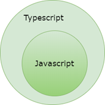

If you look at the picture above, you will understand, every Javascript Code is a typescript and typescript provides new advantages for javascript so it is often called Extended Javascript.

*What if we could strengthen JavaScript with the things that are missing for large scale application development, like static typing, classes [and] modules... that’s what TypeScript is about.*

*—Anders Hejlsberg*

Typescript does not provide new functionality in the runtime, it offers a number of features that help developers to write more maintainable code than using Javascript. One of the features is implementing modern programming language paradigm like object oriented language.

A program written using typescript must first be compiled (technically it should be transpiller) into javascript so that it can be executed by a browser or javascript engine.

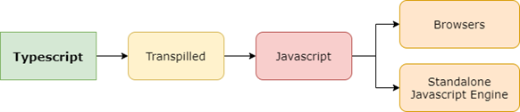

As a javascript superset we can convert any javascript file into a typescript file by changing its extension:


Typescript is also a superset of EcmaScript which determines the standard specification for writing javascript. ES Next represents future and final versions of EcmaScript.

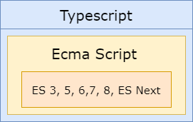

As a javascript superset what advantages can typescript provide?


## Why Typescript?


### Static Typing

Javascript is a language that has dynamic typing characteristics, to see how the dynamic typing program is working we need to run it. With dynamic typing we cant make a prediction how the code is expected, so here is the typescript came up as an alternative programming paradigm. With Static Type System on typescript we can make a prediction how the code is expected before it runs.

Static Type System help us to understand the shape and behaviors on our code.

As a superset, typescript provides the new advantage of supporting static typing characteristics. So, what are the advantages of static typing?

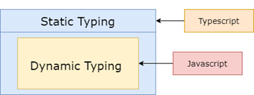

Every time we create a new variable we must first define the data type. Once this type has been specified, we cannot change it. This protects developers from a bunch of common bugs and security flaws in the code we write. Software development becomes more secure.

Below we create a variable name with data type number. However we pass a string literal so that the typescript code will fail when it compiles into javascript :

```typescript
let fullname: number;
fullname = "Gun Gun Febrianza"; // compile-time error
```


### Type Annotation

Typescript provide type annotation so any code editor can perform static code analysis, like autocompletion and better refactoring system to improve developer productivity. Type Annotation helping the development of static type checker tools.


---


## Install

To start typescript project, create new directory and execute this command :

```bash
$ tsc --init
```

Here is a minimum configurations from author :

```json
{
  "compilerOptions": {
    "sourceMap": true,
    "outDir": "./dist",
    "strict": true,
    "lib": ["esnext"],
    "esModuleInterop": true
  },
  "include": ["**/*.ts"],
  "exclude": ["node_modules"]
}
```

Then execute this command to create node project :

```bash
$ npm init -y
```

Then on file package.json, change the build command :

```json
  "scripts": {
    "build": "npx tsc"
  },
```

Execute this command to build the project :

```bash
$ npx tsc
```


---


## Node Typing

Try to create test.ts and then write this code :

```javascript
console.log("Hello World!"); //Prints Hello World!
```

If we create project for node applications then you will get error prompt :

```
any
Cannot find name 'console'. Do you need to change your target library? Try changing the 'lib' compiler option to include 'dom'.ts(2584)
```

To solve this issue we need to install @types/node :

```bash
$ npm install @types/node --save-dev
```

On Visual Studio Code, if we move our cursor into console keyword then the tooltips will inform about the namespace console :

```javascript
namespace console
var console: Console
The console module provides a simple debugging console that is similar to the JavaScript console mechanism provided by web browsers.

The module exports two specific components:

A Console class with methods such as console.log(), console.error() andconsole.warn() that can be used to write to any Node.js stream.
A global console instance configured to write to process.stdout and process.stderr. The global console can be used without callingrequire('console').

Warning: The global console object's methods are neither consistently synchronous like the browser APIs they resemble, nor are they consistently asynchronous like all other Node.js streams. See the note on process I/O for more information.

Example using the global console:

console.log('hello world');
// Prints: hello world, to stdout
console.log('hello %s', 'world');
// Prints: hello world, to stdout
console.error(new Error('Whoops, something bad happened'));
// Prints error message and stack trace to stderr:
//   Error: Whoops, something bad happened
//     at [eval]:5:15
//     at Script.runInThisContext (node:vm:132:18)
//     at Object.runInThisContext (node:vm:309:38)
//     at node:internal/process/execution:77:19
//     at [eval]-wrapper:6:22
//     at evalScript (node:internal/process/execution:76:60)
//     at node:internal/main/eval_string:23:3

const name = 'Will Robinson';
console.warn(`Danger ${name}! Danger!`);
// Prints: Danger Will Robinson! Danger!, to stderr
Example using the Console class:

const out = getStreamSomehow();
const err = getStreamSomehow();
const myConsole = new console.Console(out, err);

myConsole.log('hello world');
// Prints: hello world, to out
myConsole.log('hello %s', 'world');
// Prints: hello world, to out
myConsole.error(new Error('Whoops, something bad happened'));
// Prints: [Error: Whoops, something bad happened], to err

const name = 'Will Robinson';
myConsole.warn(`Danger ${name}! Danger!`);
// Prints: Danger Will Robinson! Danger!, to err
@see — source
```

If the project that we want to create is web applications inside the browser then add this configuration on tsconfig :

```json
        "lib": [
            "es6",
            "dom"    <------- Add this "dom" here
        ],
```


---


# Debugging Typescript

First, create new project for example basic-debug directory :

```bash
$ mkdir basic-debug 
```

Initiate node project :

```bash
$ npm init -y
```

Install typescript and ts-node/register packages to the development dependencies on our project :

```bash
$ npm install --save-dev ts-node typescript
```


---

  

## Add Sourcemap

VS Code has built-in support for TypeScript debugging. To support  debugging TypeScript in combination with the executing JavaScript code,  VS Code relies on [source maps](https://developer.mozilla.org/docs/Tools/Debugger/How_to/Use_a_source_map) for the debugger to map between the original TypeScript source code and the running JavaScript. You can create source maps during the build by  setting `"sourceMap": true` in your `tsconfig.json`.

Create typescript configurations with tsconfig.json name, and put this configs :

```json
{
  "compilerOptions": {
    "target": "es2016",
    "module": "commonjs",
    "sourceMap": true
  }
}
```


## Config Debugger

In this book the author recommend external debugger. Go to extensions on visual studio code and install TypeScript Debugger written by kakumei. 

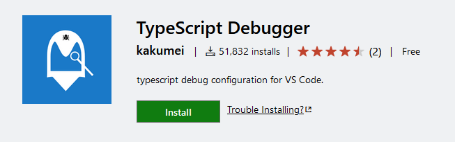

After install above typescript debugger, try to Create stack.ts file for testing purpose :

```typescript
class Stack {
  items: string[];
  constructor() {
    this.items = [];
  }
}

const ostack = new Stack();
ostack.items.push("Hello World!");
console.log(ostack);
```

Click F5, and pick TS Debug, new launch.json will be created :

```json
{
  // Use IntelliSense to learn about possible attributes.
  // Hover to view descriptions of existing attributes.
  // For more information, visit: https://go.microsoft.com/fwlink/?linkid=830387
  "version": "0.2.0",
  "configurations": [
    {
      "name": "ts-node",
      "type": "node",
      "request": "launch",
      "args": ["${relativeFile}"],
      "runtimeArgs": ["-r", "ts-node/register"],
      "cwd": "${workspaceRoot}",
      "protocol": "inspector",
      "internalConsoleOptions": "openOnSessionStart"
    }
  ]
}
```

Close the config, since we will not change anything.


---


## Debugging

Now try debugging by click the line number you want to preview, in this case the author debug the last statements :

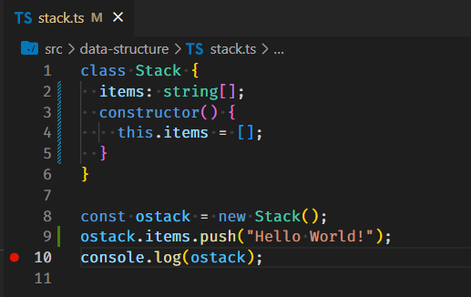

Then here is the result of debugging :

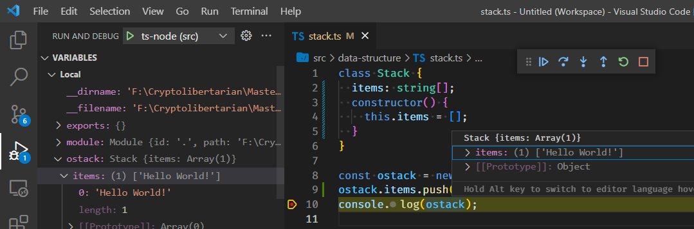

Happy Debugging!


---


# Variable Declaration


## Type Annotations

Typescript uses Type Annotations to explicitly assign data type to an identifier. When an identifier, variable, function, or object has been assigned a type annotation, the identifier can only use the data type that has been given.

Typescript supports Static Typing which prevents us from creating a generic variable. If we are developing an application using the Deno runtime which uses typescript then we can use the type annotation every time we create an identifier.

When we declare a variable in typescript, we must add a colon and type annotation. Below are the type annotations available in typescript:

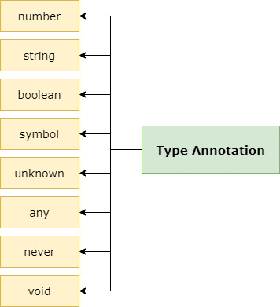

To declare the data type of a variable we can do it explicitly or implicitly :


---


### Declare Explicit 

Below is an example of using type annotations on primitive data types. The declaration is done explicitly by asserting the given data type :

```typescript
const username: string = "Maudy Ayunda";
const height: number = 167.13;
const isCute: boolean = true;
```


---


### Declare Implicit

Below is an implicit data type declaration, the typescript compiler will auto-type the data based on the given literal :

```typescript
const username = "Maudy Ayunda";
const height = 167.13;
const isCute = true;
```


----


# Data Types


## Primitive Types

As discussed earlier, JavaScript has 8 Data Types and 7 of them are called primitives or primitive values.

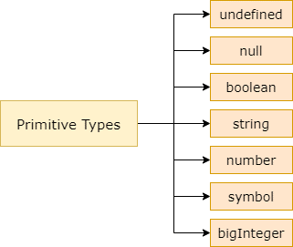

The term primitive is used because it only stores a single value, data is not an object and has no methods. Previously in javascript we could create a primitive type without using a type annotation:

```javascript
// strings
var name = "Gun Gun Febrianza";

// numbers
var age = 25;
var price = 1.51;

// boolean
var isExist = true;

// null
var objectx = null;

// undefined
var flag = undefined;
var ref; // undefined too

```

Here is an example to declare primitive types variable on typescript : 

```typescript
let productName: string;
let chainID: number;
let isPowerful: boolean;
productName = "Polygon Edge";
chainID = 137;
isPowerful = true;
console.log(productName);
```

We will learn about symbol and big integer on another chapter.

In javascript, when a variable wants to store literal in the form of primitive value, the variable stores the value directly. If we create a variable with values derived from other variables, each one gets a copy. Here is an example :

```typescript
var animal1: string = "dinosaurus";
var animal2: string = animal1;
```

Variable animal1 on above code store string literal and variable animal2 is tried to binding the value to the value on animal1.


Although animal1 and animal2 has the same value, each of one store value independently. If we change the value from variable animal1 then the value on variable2 will not changed. Here is an example :

```typescript
var animal1: string = "dinosaurus";
var animal2: string = animal1;

console.log(animal1); //dinosaurus
console.log(animal2); //dinosaurus

animal1 = "Godzilla";
console.log(animal1); //Godzilla
console.log(animal2); //dinosaurus
```

In javascript, primitive types has a characteristic of immutable.


---


### Immutable

Using the last example we know that **animal1** has a **"Godzilla"** literal value and we can change the strings into upper case by calling **toUpperCase() method** to become **"GODZILLA"**. Most peoples think the value of **animal1** is changed, but the result is not changed because it's immutable

```typescript
animal1 = "Godzilla";
console.log(animal1.toUpperCase()); //GODZILLA
console.log(animal1); //Godzilla
```


---


## Reference Types

In javascript, reference types are represented by an object. An object is different from a primitive, an object can have different forms and values. An object is capable of storing various values (hetererogenously).

Objects can store all values that belong to primitive types. This flexible nature makes objects can be used to build a custom data type.

When we interact with web browsers using JavaScript we will be acquainted with the built-in objects, a set of objects built into the web browser that we can use to make it easier to solve problems in programming languages. Below is an example of a built-in object in javascript:

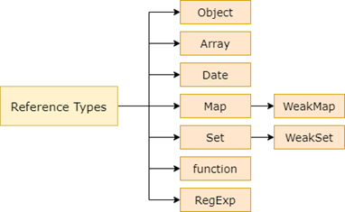

The built-in object is also available in Node.js/Deno Runtime Engine, below is an example of a simple object that has properties and methods in the javascript :

```javascript
let Gun = {
    name: "GGF",
    ucapSalam: function () {
        alert("Hello World!!");
    }
};
Gun.ucapSalam(); // Hello World!
```

Here an example on typescript :

```typescript
type humanoid = {
  name: string;
  sayHello(): string;
};

let Gun: humanoid = {
  name: "GGF",
  sayHello: function () {
    return "Hello World!!";
  },
};
console.log(Gun.sayHello()); // Hello World!
```


---


## Custom Type

With the type keyword we can create a new type or a type alias. Below we create a type alias:

```typescript
type Balance = number;
type Type = string;
```

Next we create a new type:

```typescript
type Wallet = {
    name: string;
    amount: Balance;
    symbol: Type;
};
```

In the Type Wallet above we use two type aliases for the amount and symbol properties. Next we can create a variable with the Wallet data type:

```typescript
let bitcoinWallet: Wallet = {
    name: "Bitcoin",
    amount: 5.88800007,
    symbol: "BTC",
};
```

Furthermore, every time we create a variable of type Wallet make sure we fill in every available property otherwise the result will be an error. If you don't want an error to occur then we have to use optional properties using a question mark.

Look at the code below:

```typescript
type CryptoWallet = {
    name: string;
    amount: Balance;
    symbol?: Type;
};

let ethereumWallet: CryptoWallet = {
    name: "Ethereum",
    amount: 23.88800007,
};
```

The symbol property uses a question mark, so if we don't fill in the symbol property when creating a variable the error will not occur.


---


## Enums

In programming language we can use enums to define an object that has finite properties to setup information. 

We can learn from javascript version then to typescript version.


---


### Javascript Way

In javascript we can create enums as object keys, for example :

```javascript
const blockchain = {
    Bitcoin: "Bitcoin",
    Ethereum: "Ethereum",
    Polkadot: "Polkadot",
    Polygon: "Polygon",
    Solana: "Solana"
}
```

To get the information we can access specific properties or all properties :

```javascript
console.log(blockchain); // Get All Properties
console.log(blockchain.Bitcoin); //Access Enum properties
```

We can also using number as values :

```javascript
const NBlockchain = {
  Bitcoin: 0,
  Ethereum: 1,
  Polkadot: 2,
  Polygon: 3,
  Solana: 4,
};
```

Here we try to compare by number using ternary operator :

```javascript
0 == NBlockchain.Bitcoin ? console.log(true) : console.log(false); //true
1 == NBlockchain.Bitcoin ? console.log(true) : console.log(false); //false
```

To prevent collision we can using symbol object :

```javascript
const Satoshi1 = Symbol("Satoshi Nakamoto");
const Satoshi2 = Symbol("Satoshi Nakamoto");
```

If we compare both it will return false on javascript, note: dont do it on typescript.

The problem with this code is not immutable, we can change the value object that we want to treat as enums :

```javascript
const SymBlockchain = {
  Bitcoin: Symbol("Bitcoin"),
  Ethereum: Symbol("Ethereum"),
  Polkadot: Symbol("Polkadot"),
  Polygon: Symbol("Polygon"),
  Solana: Symbol("Solana"),
};

console.log(SymBlockchain.Bitcoin); //Symbol(Bitcoin)
SymBlockchain.Bitcoin = Symbol("Shitcoin");
console.log(SymBlockchain.Bitcoin); //Symbol(Shitcoin)
```

To transform above code into immutable object we can use **Object.freeze() method**, here is the example :

```javascript
const EnumBlockchain = Object.freeze({
  Bitcoin: Symbol("Bitcoin"),
  Ethereum: Symbol("Ethereum"),
  Polkadot: Symbol("Polkadot"),
  Polygon: Symbol("Polygon"),
  Solana: Symbol("Solana"),
});
```

When we try to change the value :

```javascript
EnumBlockchain.Bitcoin = Symbol("Bitconnect"); // Error
```

Its become immutable, you cant change the value.

```
"Cannot assign to 'Bitcoin' because it is a read-only property.",
```


---


### Typescript Way


#### Numeric Enums

In typescript enums are set of named constants, we can isolate a list of constants to define real world object. Here we create enum Blockchain and all the member will become numeric constant starting from zero.

```typescript
enum Blockchain {
  Bitcoin,
  Ethereum,
  Polkadot,
  Polygon,
  Solana,
}
```

If we try to see the constants on enums we will get the number position :

```javascript
console.log(Blockchain.Bitcoin); //0
```

We can also setup the order numbering system on enums :

```typescript
enum Blockchain {
  Bitcoin,
  Ethereum = 100,
  Polkadot,
  Polygon,
  Solana,
}

console.log(Blockchain.Bitcoin); //0
console.log(Blockchain.Ethereum); //100
console.log(Blockchain.Polkadot); //101
console.log(Blockchain.Polygon); //102
```


---


#### String Enums 

String enums dont have auto-increment behavior

```typescript
enum BlockchainRPC {
  Server = "SERVER-ADDRESS",
  Height = "HEIGHT",
  Latency = "LATENCY",
  Score = "SCORE",
}

console.log(BlockchainRPC);
//{ Server: "SERVER-ADDRESS", Height: "HEIGHT", Latency: "LATENCY", Score: "SCORE" }
console.log(BlockchainRPC.Latency); //Latency
```


---


## Type Widening

When you make a computation on javascript, undefined and null literal value is often become the source of error. On typescript if we declare variable without assignning a value, then internally typescript will convert to **any type**. Typescript compiler also support **--strictNullCheck option** to prohibit declare new variable with null type. 

If that  **--strictNullCheck option** is configured then error will occur on this example code :

```typescript
let bitcoin = 21000000;
bitcoin = null; //compile error
bitcoin = undefined; //compile error
```


----


### Undefined

In javascript, when new variable created without any value will automatically assigned undefined value.

```javascript
var bitcoin;
console.log(bitcoin)
```

The differences between null and undefined is null variable must be declared in explicit way.

```javascript
console.log(typeof undefined);
//"undefined"
console.log(typeof null);
//"object"
console.log(null === undefined);
//false
console.log(null === undefined);
//true
```


---


### Null

In javacript null mean nothing, but internally javascript treat null as object.

```typescript
var genesisBlock = null;
console.log(typeof genesisBlock); //object
```

Previously we know that null is primitive types, why javascript treat null as object? this is really good question.

It's happen since the first time javascript interpreter is released. That is why Douglas Crockford called javascript language as *the world's most misunderstood programming language*. 

```javascript
// This stands since the beginning of JavaScript
typeof null === 'object';
```

There was some proposal to fix this problem with below code :

```javascript
typeof null === 'null';
```

When the author read **You Dont Know JS**, there is exist interesting opinion :

> *This is a long-standing bug in JS, but one that is likely never going to be fixed. Too much code on the Web relies on the bug and thus fixing it would cause a lot more bugs!*


---


# Object

Previously when you learn about Data Types, you has been learn what is object but the term about object is really ambigous on javascript. Object that we learn before is Fundamental Object, one of the built-in Object inside javascript engine. 

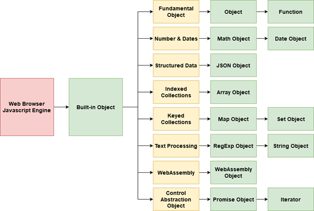


---


## Fundamental Object

Basically everything on javascript is an object, there is fundamental objects whch become the basis of all objects on javascript engine. Here is the lists :

1. Object
2. Function
3. Boolean
4. Symbol
5. Error
6. EvalError
7. InternalError
8. RangeError
9. ReferenceError
10. SyntaxError
11. TypeError
12. URIError


---


## Custom Object Types

The author is emphasizing again that basically everything in javascript is an object and we can create our own custom object. Here is the diagram that we can create properties with primitype types or built-in objects that provided by the javascript engine.

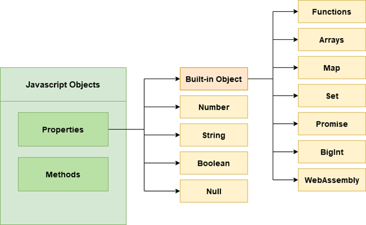

In previous chapter when you learn about reference types you are basically create your own custom object types.


---


### Type Template 

Here is an example to create an object using type template on typescript :

```typescript
const blockchain: {
  name: string;
  creator: string;
  totalCoin: number;
} = {
  name: "Bitcoin",
  creator: "Satoshi Nakamoto",
  totalCoin: 21000000,
};
```

On above code we will define the data types that required for the properties for the blockchain object.


---


### Type Alias 

Here is an example to create an object using type alias :

```typescript
type TBlockchain = {
  name: string;
  creator: string;
  totalCoin: number;
};

const Type_bitcoin: TBlockchain = {
  name: "Bitcoin",
  creator: "Satoshi Nakamoto",
  totalCoin: 21000000,
};
```


----


### Interface 

Here is an example to create an object using interface :

```typescript
interface IBlockchain {
  name: string;
  creator: string;
  totalCoin: number;
}

const Interface_bitcoin: IBlockchain = {
  name: "Bitcoin",
  creator: "Satoshi Nakamoto",
  totalCoin: 21000000,
};
```


---


### Mutable Properties 

**Javascript object** has a **mutable** characteristic, meaning we can change the **properties value**.

```typescript
interface IBlockchain {
  name: string;
  creator: string;
  totalCoin: number;
}

const InterfaceBitcoin: IBlockchain = {
  name: "Bitcoin",
  creator: "Satoshi Nakamoto",
  totalCoin: 21000000,
};

console.log(InterfaceBitcoin.creator); //Satoshi Nakamoto
InterfaceBitcoin.creator = "Anonymous";
console.log(InterfaceBitcoin.creator); //Anonymous
```


---


### Object Destructure 

For object literal we can operate destructure, here is an example to get value from specific properties :

```typescript
interface IBlockchain {
  blockchain: string;
  creator: string;
  totalCoin: number;
}

const Interface_bitcoin: IBlockchain = {
  blockchain: "Bitcoin",
  creator: "Satoshi Nakamoto",
  totalCoin: 21000000,
};

const { blockchain, creator } = Interface_bitcoin;
console.log(`${blockchain} is invented by ${creator}`);
```


---


### Dynamic Properties

There is a time when we dont know what property from our object will be needed in the future, to support this problem we need dynamic properties.


---


#### Index Type Signature 

We can create dynamic properties for an object via Index Type Signature, here is an example :

```typescript
interface NFT {
  [key: string]: any;
}

const boredAPE: NFT = {};
boredAPE.creator = "Yuga Labs";
boredAPE.builtOn = "Ethereum";
boredAPE.amount = 10000;

console.log(boredAPE); // { creator: 'Yuga Labs', builtOn: 'Ethereum', amount: 10000 }
```

We can combine Index Type Signature with Interface Property to add new specific properties that enforce to be use when object is created.

```typescript
interface blockchain {
  [key: string]: any;
  name: string;
}

const Opolygon: blockchain = {
  type: {
    testNet: "Mumbai",
    layer: "Layer2",
  },
  name: "Polygon PoS",
};

console.log(Opolygon); // { type: { testNet: 'Mumbai', layer: 'Layer2' }, name: 'Polygon PoS' }
```

From above example we cant create object Opolygon without name property.


---


#### Record Type

We can also use Record Type to create an object with dynamic properties :

```typescript
const agent: Record<string, any> = {};
agent.name = "Gun";
agent.age = 30;
agent.skill = ["DevOps", "Blockchain"];

console.log(agent); //{ name: 'Gun', age: 30, skill: [ 'DevOps', 'Blockchain' ] }
```


---


### Optional Properties

In typescript we can create optional properties for an object, so we have an option to determine which property that will be used for an object.

```typescript
interface person {
  fullname: "Gun Gun Febrianza";
  twitter: string;
  listCoin: string[];
  bitcoiners?: boolean;
}

const man: person = {
  fullname: "Gun Gun Febrianza",
  twitter: "@daddybitcoin",
  listCoin: ["Bitcoin", "Liquid Bitcoin"],
};

const libertarian: person = {
  fullname: "Gun Gun Febrianza",
  twitter: "@daddybitcoin",
  listCoin: ["Bitcoin", "Liquid Bitcoin"],
  bitcoiners: true,
};

console.log(man);
```


---


### Read Only Properties

In typescript we can create readonly properties, but does not mean read only property is absolutely immutable. The goal of read only property is to prevent the value cant be rewritten at the development time especially when type checking. On the runtime, readonly property does not change the behaviour of the program.

Below is an example of readonly properties manipulation via object reference :

```typescript
interface Person {
  name: string;
  age: number;
  sex: string;
}

interface ReadonlyPerson {
  readonly name: string;
  readonly age: number;
}

let writablePerson: Person = {
  name: "Gun Gun Febrianza",
  age: 30,
  sex: "male",
};

// works
let readonlyPerson: ReadonlyPerson = writablePerson;

console.log(readonlyPerson.age); // prints '30'
writablePerson.age++;
console.log(readonlyPerson.age); // prints '31'
```


---


### Extending Types

You can read about interface here.


---


### Generic Object Types

Here is an example of Generic Object Types :

```typescript
interface CryptoCoin<Type> {
  CoinType: Type;
  EVMBased?: Type;
  shitcoin?: Type;
}

let whatCoin: CryptoCoin<string> = {
  CoinType: "ERC-20 Token",
};

console.log(whatCoin.CoinType); // //ERC-20 Token

type boolOrNumber = boolean | number;

let anyCoin: CryptoCoin<boolOrNumber | string> = {
  CoinType: 1,
  EVMBased: true,
  shitcoin: "No",
};

console.log(anyCoin);
// { CoinType: 1, EVMBased: true, shitcoin: 'No' }
```


---


### Complex Object Types

Here is an example of Complex Object Types :

```typescript
type TypeAlias = number[];

let objComplex: {
  a: string[];
  b: (param: string[]) => string[];
  c: { d: boolean; e: TypeAlias };
} = {
  a: ["Hi", "Maudy"],
  b: function (param: string[]): string[] {
    return this.a;
  },
  c: { d: true, e: [22, 33] },
};

console.log(objComplex);
```

The output from above code is :

```
{
  a: [ 'Hi', 'Maudy' ],
  b: [Function: b],
  c: { d: true, e: [ 22, 33 ] }
}
```

We can simplified above code :

```typescript
type TypeAlias = number[];
type ComplexObj = {
    a: string[];
    b: (param: string[]) => string[];
    c: { d: boolean; e: TypeAlias };
};

let objComplex: ComplexObj = {
    a: ["Hi", "Maudy"],
    b: function (param: string[]): string[] {
        return this.a;
    },
    c: { d: true, e: [22, 33] },
};

console.log(objComplex);
```


---


## Object Comparison

Here is an example code to compare two object that has been created via interface and type alias :

```typescript
const blockchain: {
  name: string;
  creator: string;
  totalCoin: number;
} = {
  name: "Bitcoin",
  creator: "Satoshi Nakamoto",
  totalCoin: 21000000,
};

type TBlockchain = {
  name: string;
  creator: string;
  totalCoin: number;
};

const Type_bitcoin: TBlockchain = {
  name: "Bitcoin",
  creator: "Satoshi Nakamoto",
  totalCoin: 21000000,
};

interface IBlockchain {
  name: string;
  creator: string;
  totalCoin: number;
}

const Interface_bitcoin: IBlockchain = {
  name: "Bitcoin",
  creator: "Satoshi Nakamoto",
  totalCoin: 21000000,
};

console.log(typeof blockchain); //object
console.log(blockchain);

console.log(typeof Interface_bitcoin);  //object
console.log(Interface_bitcoin);

console.log(typeof Type_bitcoin); //object
console.log(Type_bitcoin);

console.log(Interface_bitcoin == Type_bitcoin); //false
console.log(Interface_bitcoin === Type_bitcoin); //false
```

If we compare two object that has been created via **type template** and **interface** here is the result :

```typescript
console.log(blockchain == Interface_bitcoin); //false
console.log(blockchain === Interface_bitcoin); //false
```

If we compare two object that has been created via **type alias** and **type interface** here is the result :

```typescript
console.log(Type_bitcoin == blockchain); //false
console.log(Type_bitcoin === blockchain); //false
```


---


## JSON

JSON is the abbreviation of Javascript Object Notation, JSON used for data exchange between browser and server or vice versa. We can change native javascript object (object literal) into JSON and we can change JSON into native javascript object. 


---


### JSON & Object Literal

Here is an example of Object Literal :

```javascript
{ 
    name: "Gun Gun Febrianza", 
    bitcoiners: "Maximalist"
}
```

If we change object literal above into JSON here is the example :

```json
{ 
    "name": "Gun Gun Febrianza", 
    "bitcoiners": "Maximalist"
}
```

There is significant change between *Object Literal* and *JSON*, on JSON there is more rules applied :

1. To use **function** as *value* for *properties* is not allowed in JSON.

2. To use **date object** as *value* for *properties* is not allowed in JSON.

3. To use **undefined** as *value* for *properties* is not allowed in JSON.


---


### Stringify

Process to transform **object literal** into JSON is called stringify. In the real world case if we want to send data to the server we need to transform our data into efficient data exchange format, so we need to stringify our object literal into JSON.


Below is an example of object literal transformed into JSON :

```javascript
var objectLiteral = {
    name: "Gun Gun Febrianza",
    age: 30,
    city: "New York"
};
```

To change our object literal into JSON, we will use built-in object that has been provided by javascript engine called JSON Object. This object has stringify() method that we can implement :

```javascript
var JSONData = JSON.stringify(objectLiteral);
```

To make sure our data is transformed into JSON, we can confirm using **typeof keyword** :

```typescript
console.log(typeof JSONData) // string
console.log(JSONData)
// {"name":"Gun Gun Febrianza","age":30,"city":"New York"}
```

If the output is string then the object literal is succeed transformed.


---


### Parse JSON 


```

```


----


### Parse Date in JSON


```

```


---


# Interface


## Extending Interface 

In javascript we can add new arbitrary property to an object with prototype, typescript provide elegant way to add new property to an object using extend keyword :

```typescript
interface coin extends creator {
  name: string;
  supply: number;
}

interface creator {
  created: string;
  author: "Satoshi Nakamoto";
}

const bitcoin: coin = {
  name: "bitcoin",
  supply: 21000000,
  created: "2009",
  author: "Satoshi Nakamoto",
};

console.log(bitcoin);
```


----


## Intersection Types

Interface support for creating new custom type via intersection types by combination between interface. To create intersection types we need & operator :

```typescript
interface Bitcoin {
  lightningNetwork: string;
}
interface LiquidBitcoin {
  confidential: string;
}

type superblockchain = Bitcoin & LiquidBitcoin;

const powerfulBlockchain: superblockchain = {
  lightningNetwork: "Yes",
  confidential: "Support Confidential Transaction!",
};

console.log(powerfulBlockchain);
```


----


# Modules

Any typescript code that we wrote is actually live on the global scope, so if we have several files on one project, all variables, functions, class will be interpreted in the same environment within global scope. Any written typescript code on one file can be accessed by another file and vice versa.

For Example, when we create file1.ts with this code :

```typescript
const hello : string = "Hello World!";
```

 and then we create another file2.ts with this code :

```typescript
console.log(hello); //Prints Hello World!

hello = "Hello Maudy!"; // allowed
```

**hello variable** is being known and interpreted in the global scope environment. This accessibility is dangerous, since potential conflict and error in the typescript project could happen. There is possibility any code will be overwritten and modified without we know.

To handle this problem, typescript offer modules and namespaces concept to prevent any code into global scope. Modules and Namespaces concept also helping for maintain large scale codebase.

The goals of modules is to isolate within local scope, so any variable, function, class that has been declared inside the modules cant be accessed by external modules. We can create module using **export keyword** and for using module there is **import keyword**.

In typescript, any file with top-level export or import is recognized as modules. Below is an example of module inside file1.ts :

```typescript
export const hello : string = "Hello World!";
```

If we execute file2.ts, then we will get error :

```typescript
console.log(hello); //Error: cannot find 'hello'

hello = "Hello Maudy!"; // allowed
```


---


## Export 

Try to create file **Employee.ts** and write this code :

```typescript
export let age: number = 30;
export class Employee {
  employeeID: number;
  employeeName: string;
  constructor(name: string, code: number) {
    this.employeeName = name;
    this.employeeID = code;
  }
  printEmployee() {
    console.log(
      "Employee ID: " +
        this.employeeID +
        ", Employee Name: " +
        this.employeeName
    );
  }
}
let companyName: string = "The Boring Company";
```


----


## Import - Single Module 

Try to create file **MainEmployee.ts** and write this code :

```typescript
import { Employee } from "./Employee";

let employeeObject = new Employee("Gun Gun Febrianza", 1);
employeeObject.printEmployee();
```

Above code is an example of single module import.


---


## Import - Entire Module 

Here is an example to import entire module :

```typescript
import * as EMP from "./Employee";

let employeeObject = new EMP.Employee("Gun Gun Febrianza", 1);
employeeObject.printEmployee();
```


----


## Import - Rename Module

Here is an example how to rename imported module :

```typescript
import { Employee as manpower } from "./Employee";

let employeeObject = new manpower("Gun Gun Febrianza", 1);
employeeObject.printEmployee();
```


---


## Compiling Modules

To compile **modules** we need to determine the **target environment**, there is several target below :

1. None
2. CommonJS
3. Node16
4. AMD
5. UMD
6. System
7. ES6, ES2015, ESNext
8. NodeNext

Add this **flags** when we compile the **modules** :

```
--module <target environment> <file path>
```

For **Target Environment** :

- If our target is the **server-side applications** for **node.js** use **CommonJS Module Loader**.
- If our target is the **client-side applications** for **web browser apps** use **AMD Target** which is loaded via **require.js**.
- If our target is the **server-side** and **client-side modules** use **UMD Target**.


----


# Collection


----


## What is Collections?


----


## What is Indexed Collections?


### Array

Before we create and use an array, we need to understood that array has a characteristics of iterable, destructable and does not support keyed. According to David Flanagan, the author of Javascript - The Definitive Guide (2002) book, array is data type to store value with number or numbered values. Value that has been assigned by number called element and the number of that value is called index. An array can store primitive type and object, also array within array.

Here is an example of one-dimensional array : 

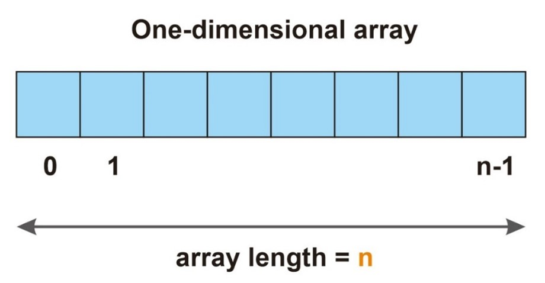


----


### Create Array 


----


### Iterate Array 


----


### Array Property & Methods 


---


Here is basic array methods if we want to add and remove element to an array using LIFO style :


We can execute this operations also on array of objects :

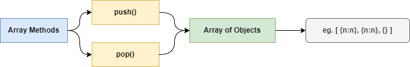


---


#### Push Method 

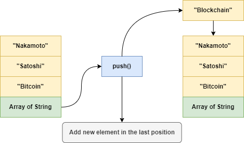

Here is an example code using **push() method** to add new element in the last position:

```javascript
var arrayStr: string[] = [];
arrayStr.push("Bitcoin");
arrayStr.push("Satoshi");
arrayStr.push("Nakamoto");
arrayStr.push("Blockchain");
```

To make sure we are successful adding new element to the array, we can access length property of the array :

```typescript
console.log(arrayStr.length); 
```

Output :

```
4
```


---


#### Pop Method 


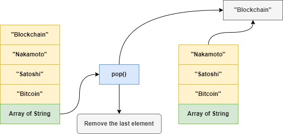

Here is an example code using **pop() method** to remove the last element :

```javascript
var arrayStr: string[] = [];
arrayStr.push("Bitcoin");
arrayStr.push("Satoshi");
arrayStr.push("Nakamoto");
arrayStr.push("Blockchain");
```

After we add elements to the array, lets call pop method to remove the last element :

```typescript
arrayStr.pop()
```

To make sure we are successful removing the last element in the array, we can access length property of the array :

```typescript
console.log(arrayStr.length); 
```

Output :

```
3
```


---


Here is basic array methods if we want to add and remove element to an array using FIFO style :

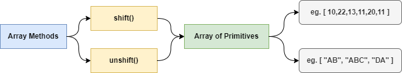

We can execute this operations also on array of objects :

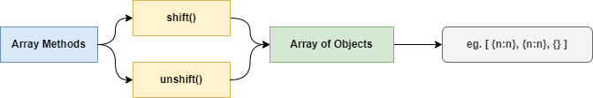


----


#### Shift Method 


```typescript

```


---


#### Unshift Method


```typescript

```


---


Here is simplified array methods if we want to find first and last element on array of primitives by value.

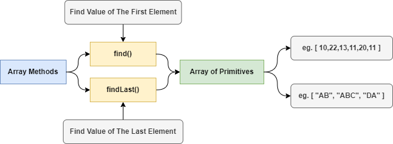

We can execute this operations also on array of objects :


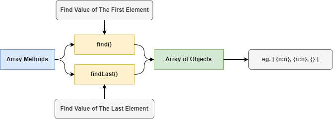


---


#### Find Method

Here is an example code using **find() method** to get the value of the first element, in this case we want to get number element bigger than 44 :

```typescript
const arrayNum: number[] = [30, 44, 55, 22, 44, 11, 60];
const firstFound = arrayNum.find((element) => element > 44);
console.log(firstFound);
```

Output :

```
55
```

We know how to find value from array of primitive, but how to find any object on array of objects? below is an array of objects example :

```typescript
interface crypto {
  id: number;
  blockchain: string;
  price: number;
}

const arrCrypto: crypto[] = [
  { id: 1, blockchain: "Polygon", price: 550 },
  { id: 2, blockchain: "Polkadot", price: 770 },
  { id: 3, blockchain: "Bitcoin", price: 1520 },
  { id: 4, blockchain: "Polygon", price: 340 },
];
```

Here is an example to find object by their property :

```typescript
const first = arrCrypto.find((obj) => {
    return obj.blockchain == "Polygon";
})
console.log(first)
```

Output :

```json
{ id: 1, blockchain: 'Polygon', price: 550 }
```


----


#### FindLast Method

At the time the author write this book, for **FindLast() method** there is caveat. Yet, this method still **not supported in Node.js Environment**. You can execute on browser environment. Here is an example code using **FindLast() method** :

```typescript
const arrayNum: number[] = [30, 44, 55, 22, 44, 11, 60];
const firstFound = arrayNum.findLast((element) => element > 44);
console.log(firstFound);
```

Output :

```
60
```

We know how to find last value from array of primitive, but how to find last object on array of objects? below is an array of objects example :

```typescript
interface crypto {
  id: number;
  blockchain: string;
  price: number;
}

const arrCrypto: crypto[] = [
  { id: 1, blockchain: "Polygon", price: 550 },
  { id: 2, blockchain: "Polkadot", price: 770 },
  { id: 3, blockchain: "Bitcoin", price: 1520 },
  { id: 4, blockchain: "Polygon", price: 340 },
];
```

Here is an example to find last object by their property :

```typescript
const first = arrCrypto.findLast((obj) => {
    return obj.blockchain == "Polygon";
})
console.log(first)
```

Output :

```json
{ id: 4, blockchain: 'Polygon', price: 340 }
```


----


Here is simplified array methods if we want to find first and last index on array of primitives by value.

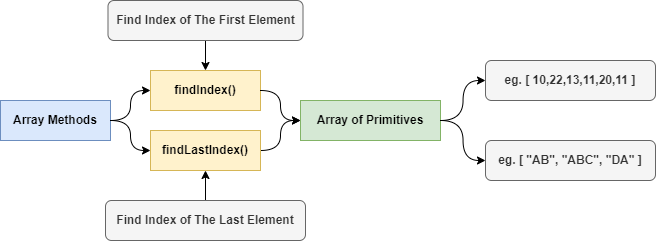

We can execute this operations also on array of objects :

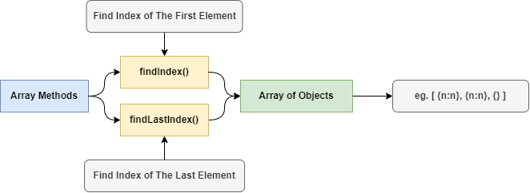


----


#### FindIndex Method

Here is an example code using **findIndex() method** to get the first index of literal value **"Apple"** :

```javascript
const arrayStr : string[] = ["Banana", "Apple", "Melon"];
const foundArStr = arrayStr.findIndex((element) = > element === "Apple");
console.log(foundArStr);
```

Output :

```
1
```

To get index on array of primitive types with better performance try **indexOf() method** :

```typescript
var arrayString: string[] = ["Banana", "Apple", "Strawberry", "Apple"];
console.time("Find Index");
const foundArrStr : number = arrayString.findIndex((element) => element === "Apple");
console.log(foundArrStr); //1
console.timeEnd("Find Index");

console.time("Index Of");
const resIndexOf : number = arrayString.indexOf("Apple");
console.log(resIndexOf);
console.timeEnd("Index Of");
```

Output :

```
1
Find Index: 1.742ms
1
Index Of: 0.246ms
```

We know how to find first index from array of primitive, but how to find index any object on array of objects? below is an array of objects example :

```typescript
interface crypto {
  id: number;
  blockchain: string;
  price: number;
}

const arrCrypto: crypto[] = [
  { id: 1, blockchain: "Polygon", price: 550 },
  { id: 2, blockchain: "Polkadot", price: 770 },
  { id: 3, blockchain: "Bitcoin", price: 1520 },
  { id: 4, blockchain: "Polygon", price: 340 },
];
```

Here is an example to find first index object by their property :

```typescript
const index: number = arrCrypto.findIndex((obj: crypto) => {
  return obj.blockchain === "Polygon";
});
console.log(index);
```

Output :

```
0
```


---


#### FindLastIndex Method

At the time the author write this book, for **findLastIndex() method** there is caveat. Yet, this method still **not supported in Node.js Environment**. You can execute on browser environment. Here is an example code using **findLastIndex() method** to get the last index of literal value **"Apple"** :

```typescript
var arrayString: string[] = ["Banana", "Apple", "Strawberry", "Apple"];
const foundArrStr = arrayString.findLastIndex((element) => element === "Apple");
console.log(foundArrStr); //3
```

Output :

```
3
```

To get index on array of primitive types with better performance try **lastIndexOf() method** :

```typescript
var arrayString: string[] = ["Banana", "Apple", "Strawberry", "Apple"];
console.time("Find Last Index");
const foundArrStr : number = arrayString.findLastIndex((element) => element === "Apple");
console.log(foundArrStr); //1
console.timeEnd("Find Last Index");

console.time("Last Index Of");
const resLastIndexOf : number = arrayString.lastIndexOf("Apple");
console.log(resLastIndexOf);
console.timeEnd("Last Index Of");
```

Output :

```
3
Find Index: 2.017ms
3
Index Of: 0.256ms
```

We know how to find last index from array of primitive, but how to find index any object on array of objects? below is an array of objects example :

```typescript
interface crypto {
  id: number;
  blockchain: string;
  price: number;
}

const arrCrypto: crypto[] = [
  { id: 1, blockchain: "Polygon", price: 550 },
  { id: 2, blockchain: "Polkadot", price: 770 },
  { id: 3, blockchain: "Bitcoin", price: 1520 },
  { id: 4, blockchain: "Polygon", price: 340 },
];
```

Here is an example to find last index object by their property :

```typescript
const index: number = arrCrypto.findLastIndex((obj: crypto) => {
  return obj.blockchain === "Polygon";
});
console.log(index);
```

Output :

```
3
```


---


#### Filter Method

Here is an example code using **filter() method** to get multiple elements with number that bigger more than 40 :

```javascript
const arrayNum : number[] = [30, 44, 55, 22, 44, 11]; 
const foundArrNum : number[] = arrayNum.filter((element) => element > 40);
console.table(foundArrNum);
```

Output :

```
┌───────┬────────┐
│ (idx) │ Values │
├───────┼────────┤
│     0 │     44 │
│     1 │     55 │
│     2 │     44 │
└───────┴────────┘
```

We know how to filter from array of primitive, but how to filter any object on array of objects? below is an array of objects example :

```typescript
interface crypto {
  id: number;
  blockchain: string;
  price: number;
}

const arrCrypto: crypto[] = [
  { id: 1, blockchain: "Polygon", price: 550 },
  { id: 2, blockchain: "Polkadot", price: 770 },
  { id: 3, blockchain: "Bitcoin", price: 1520 },
  { id: 4, blockchain: "Polygon", price: 340 },
];
```

Here is an example to filter object by their property :

```typescript
const all = arrCrypto.filter((obj) => {
  return obj.blockchain === "Polygon";
});

console.table(all);
```

Output :

```
┌───────┬────┬────────────┬───────┐
│ (idx) │ id │ blockchain │ price │
├───────┼────┼────────────┼───────┤
│     0 │  1 │ "Polygon"  │   550 │
│     1 │  4 │ "Polygon"  │   340 │
└───────┴────┴────────────┴───────┘
```


----


#### For Each Method

Here is an example code using **forEach() method**, we can execute arbitrary function once for each elements in the array :

```typescript
const arrayNum: number[] = [30, 44, 55, 22, 44, 11];
arrayNum.forEach((element, index, arr) => console.log(element, index, arr));

```

**Note:** `forEach` expects a synchronous function.


---


### Multidimensional Array 


---


### Matrix 


---


### Array of Interface


---


# Data Structure


## Stack 


### Create Stack Class 

Here is an example Stack to store primitive types, in this case we will create stack to store string type :

```typescript
class Stack {
  #items: string[];
  constructor() {
    this.#items = [];
  }
  push(element: string) {
    this.#items.push(element);
  }
  pop() {
    this.#items.pop();
  }
  peek() {
    return this.#items[this.#items.length - 1];
  }
  isEmpty() {
    return this.size() === 0;
  }
  size() {
    return this.#items.length;
  }
  clear() {
    this.#items = [];
  }
}
```


### Create Stack Object 

```typescript
const ostack = new Stack();
```


### Call Push Method 

```typescript
ostack.push("Hello World!");
```


### Call Peek Method 

```

```


### Call Size Method

```

```


### Call Pop Method

```

```


### Call Clear Method 

```

```


### Call isEmpty Method

```typescript
console.log(ostack.isEmpty());
```


---


## Queue


### Create Queue Class

Here is an example Queue to store primitive types, in this case we will create queue to store number type :

```typescript
class Queue {
  #count = 0;
  #lowestCount = 0;
  #items: number[] = [];
  enqueue(element: number) {
    this.#items[this.#count] = element;
    this.#count++;
  }
  isEmpty() {
    return this.#count - this.#lowestCount === 0;
  }
  dequeue() {
    if (this.isEmpty()) {
      throw new Error("No Element!");
    }
    const result = this.#items[this.#lowestCount];
    delete this.#items[this.#lowestCount];
    this.#lowestCount++;
    return result;
  }
  peek() {
    if (this.isEmpty()) {
      return "No Element!";
    }
    return this.#items[this.#lowestCount];
  }
  size() {
    return this.#count - this.#lowestCount;
  }
  clear() {
    this.#items = [];
    this.#count = 0;
    this.#lowestCount = 0;
  }
}
```

 

### Create Queue Object

Here is an example how to create Queue object :

```typescript
const oque = new Queue();
```


### Call Enqueue Method

Since we create Queue to store number type, we can add some number to the data structure :

```typescript
oque.enqueue(10);
oque.enqueue(20);
oque.enqueue(30);
oque.enqueue(40);
oque.enqueue(50);
```


### Call Peek Method

To see value in the first element you can call peek method :

```typescript
console.log(oque.peek());
```

Output :

```
10
```


### Call Size Method

To see how many elements inside queue you can call size method :

```typescript
console.log(oque.size());
```


### Call Dequeue Method

We can remove the first element within Queue data structure, by executing this method :

```typescript
console.log(oque.dequeue());
console.log(oque.dequeue());
```

Output :

```typescript
10
20
```


### Call Clear Method 

```

```


### Call isEmpty Method

```

```


-----


# Time Programming


## ISO 8601

**ISO 8601** is an international standard to describe data communication related to date & time. 

Below is the format to express date & time using **ISO 8601** :

| Parameter          | Value                     |
| ------------------ | ------------------------- |
| Date               | 2022-06-23                |
| Date & Time in UTC | 2022-06-23T03:02:50+00:00 |
|                    | 2022-06-23T03:02:50Z      |
|                    | 20220623T030250Z          |
| Week               | 2022-W25                  |
| Week with Weekday  | 2022-W25-4                |
| Ordinal Date       | 2022-174                  |

From above data if we use moment.js we can parsing ISO 8601 format via string input :

```
2013-02-08  # A calendar date part
2013-02     # A month date part
2013-W06-5  # A week date part
2013-039    # An ordinal date part

20130208    # Basic (short) full date
201303      # Basic (short) year+month
2013        # Basic (short) year only
2013W065    # Basic (short) week, weekday
2013W06     # Basic (short) week only
2013050     # Basic (short) ordinal date (year + day-of-year)
```

Data waktu (**time part**) juga bisa diberikan, terpisah dari tanggal (**date**) menggunakan spasi atau simbol huruf T  :

We can provide time part data, separated from the date using space or letter symbol T :  

```
2013-02-08T09            # An hour time part separated by a T
2013-02-08 09            # An hour time part separated by a space
2013-02-08 09:30         # An hour and minute time part
2013-02-08 09:30:26      # An hour, minute, and second time part
2013-02-08 09:30:26.123  # An hour, minute, second, and millisecond time part
2013-02-08 24:00:00.000  # hour 24, minute, second, millisecond equal 0 means next day at midnight

20130208T080910,123      # Short date and time up to ms, separated by comma
20130208T080910.123      # Short date and time up to ms
20130208T080910          # Short date and time up to seconds
20130208T0809            # Short date and time up to minutes
20130208T08              # Short date and time, hours only
```


---


## Browser Inconsistent

Here is the data related to **Javascript Date Parsing** on **cross-browser**, you can see the browser inconsistent here :

https://dygraphs.com/date-formats.html


---


## Timestamp

In javascript, to get current timestamp in **MILLISECONDS** you can execute this statement :

```javascript
Date.now(); //1661845421947
```

The timestamp is UNIX Timestamp, a seconds since january 1, 1970 UTC. If you want to get the number of seconds, we need to divide the result by 1000 :

```javascript
return Math.floor(Date.now()/1000);
```

 
